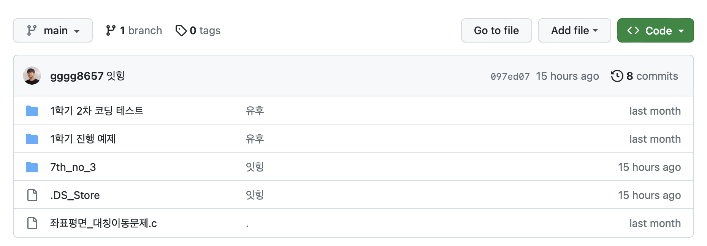
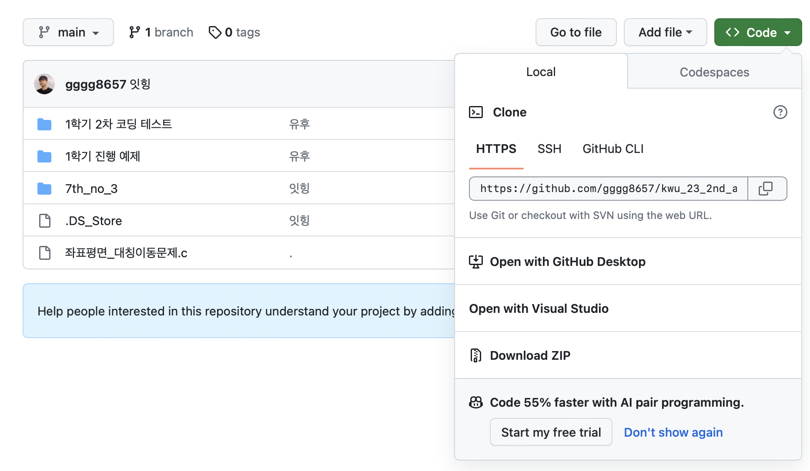
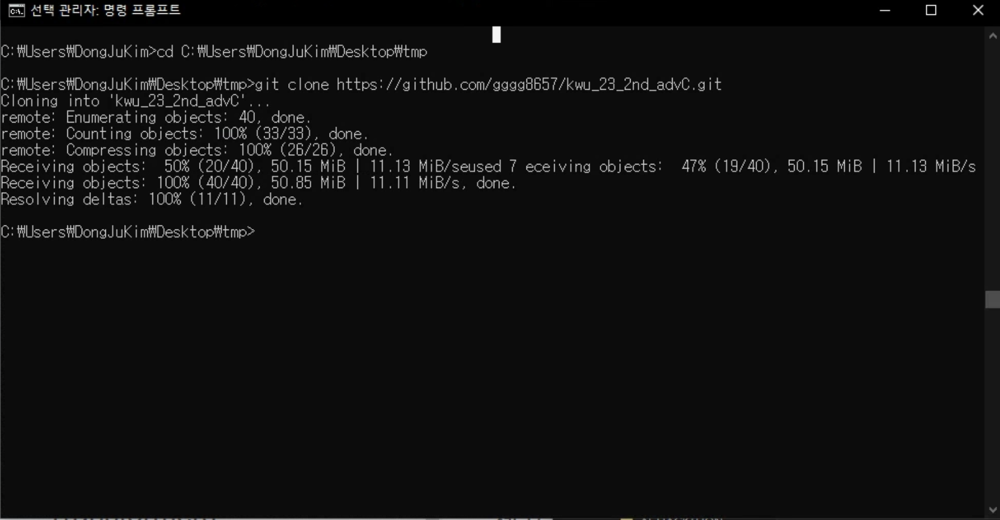
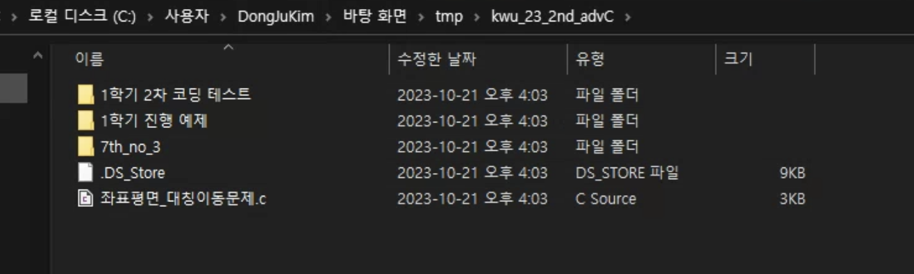
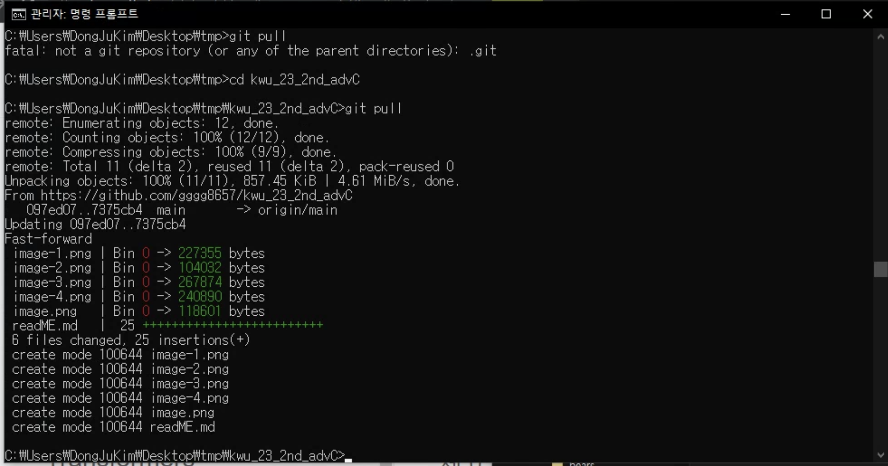

# git 레포지토리 활용법

 이 글은 1학년들을 위해 작성된 글이므로, 보기싫으면 건너뛰어도 좋습니다. 

 코드 공유를 위해, 깃헙을 사용해버린 이상 기본적인 설정 방법은 알려주어야 될 것 같아서, 끄적입니다. 

시험에 안나오니까 외우지 마세요 

## 1화

1. 우측 상단 <>code 클릭

2. 링크 전체 복사하기

3. 폴더가 저장될 위치의 경로를 cd 명령어 뒤에 붙여 이동

4. git clone + 복사한 링크 붙여넣기

5. 이렇게 나오면, 성공

6. 이렇게 하면, 그 다음부터는 위의 이미지 처럼 새로운 업데이트가 있을때, git pull 만 해주면, 다운로드가 됩니당

## 2화

깃 레포 초기 세팅에 관련된 질문이 잦아 2화를 빨리 시작한다.

시험기간에 공부할라고 다운받아볼라고 열심히 했는데, 다들 

git config 오류 등의 각양각색의 문제가 발생하는걸 들었다.

해결책에 대해 마땅히 찾지 못하거나 도움을 받지 못한 학생들을 위해

이 글을 쓰게 되었다.

사실 나보다 깃허브 다큐멘테이션이 설명 잘해주긴 할텐데...

아무튼, 크게 할일은 세가지 정도 된다.

1. 깃허브 계정 생성 및 pc에 깃 설치

2. 1화 따라하기

3. 발생한 문제 해결하기

    * 아마 다들 여기서 발생한 문제 해결하기 부분에서 막히는 사람이 많을 것 같다.
    * 이 부분을 해결하기 위한 가장 첫 단계는 1번 하기 이다.
    * 1번 안하고, 2화 따라하면, 당연히 문제만 터진다.
    * 1번 하고, 1화 따라 했는데, 터지는 문제는 보통
        * pc는 자네가, 누군지 모른다.
        * 그래서, 자네가 누군지 알려줘야 한다.
        * 필자는 레포를 공용으로 뒀기 때문에, 자네가 누군지만 알려주면, 접근이 가능하지만, 이후에 나이들어가며, 사용할 프라이빗 레포나, 팀 레포 등은 다른 처리가 필요하다.
        * 무튼 이러한 내용들은 차치하고, 본론으로 돌아가면, 
        * pc 한테 자네가 누군지 알려줘야 하는데
        #### 명령어 따라치기
        ~~~
        git config --global user.name "(본인 이름)"
        
        여기서 본인 이름은 본인 git 계정에 있는 이름을 말한다.
        필자의 경우 DongJu Kim이다.

        git config --global user.email "(본인 이메일)"

        여기서 본인 이메일은 본인 github 의 이메일이다. 깃 로그인 할떄 썼던... 그 이메일
        ~~~
        그러면, 이제 이 입력한 값을 확인하면 되는데
        
        확인을 위한 명령어는 

        git config --global user.name 

        git config --global user.email

        본인이 입력한 이름과 이메일이 맞는지 확인하고,

        
        ~~~
        windows 는 cmd 
        mac 는 terminal
        을 열어서 처리 할건데,

        windows 에 대한 설명 먼저 간다.
        결과 : 깃허브에서 디렉토리가 다운받아질거다.
        이 디렉토리를 저장하고 싶은 위치로 이동
        상단 검색창에 cmd 치고 엔터 누르면 그 경로에서 CLI 환경이 하나 열린다.

        그러면, 거기서 1화를 그대로 따라하면 된다.

        사실 이후에 무슨 문제가 생기는지, 너무 오래전에 세팅해서 잘 기억이 나지 않는다. 

        문제 발생하면, 해결 방법 못찾으시겠으면 메일 보내주세요 ^^
        ~~~

        # mac 에 대한 설명

        mac 유저는 알아서 해라. 
        
        필요하면, 연락하면 개개인별로 알려주겠다.

        ---
        ### 2화를 마무리 하며

        * 마지막 꿀팁 하나 주고, 글 마칠게요, 세상엔 너무 많은 사람들이 있어요.
        * 오류 난거 문구 대충 이거 저거 긁어다가 구글에 그대로 복붙 넣으면, 어지간하면 다 나옵니다.
        
